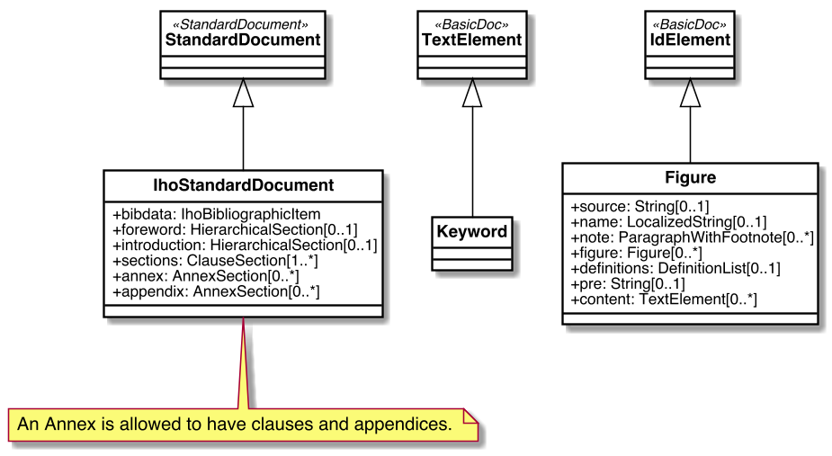
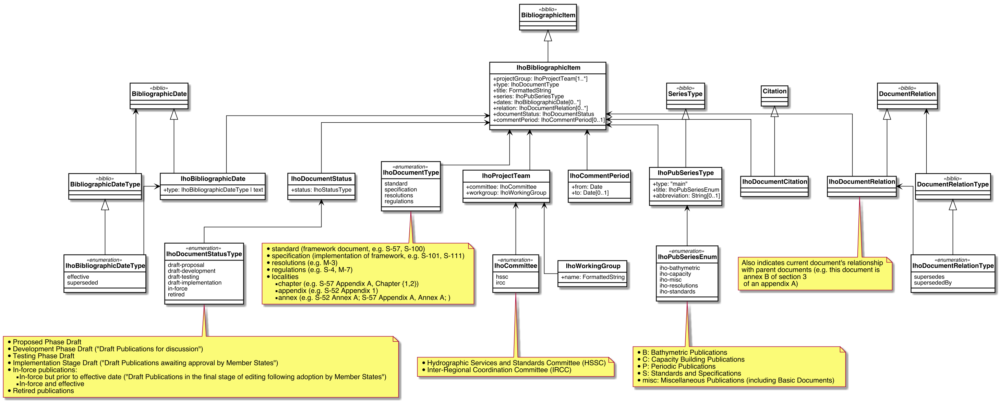

= Metanorma IHO Models

image:https://github.com/metanorma/metanorma-model-iho/workflows/make/badge.svg["Build Status", link="https://github.com/metanorma/metanorma-model-iho/actions?query=workflow%3Amake"]

This is where we keep the Metanorma IHO model definitions.

The IHO Standard Document format is an instance of the
https://github.com/metanorma/metanorma-model-standoc[Metanorma StandardDocument model].
Details of the general model can be found on its page.

== IHO Standard Document Model

== IHO Bibliographic Item Model

